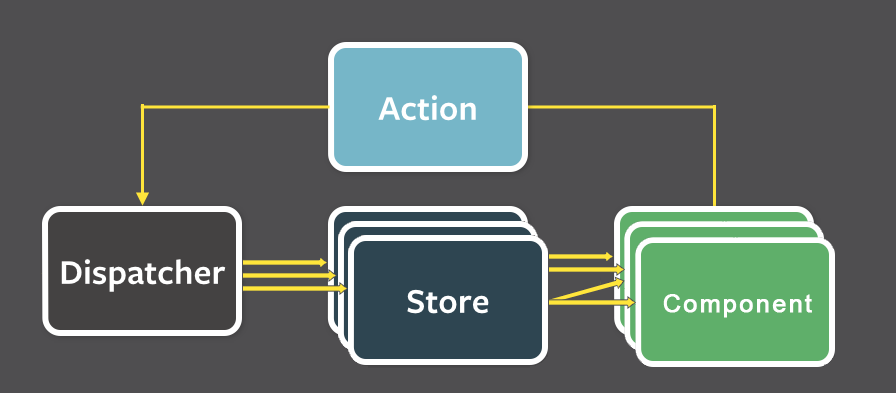
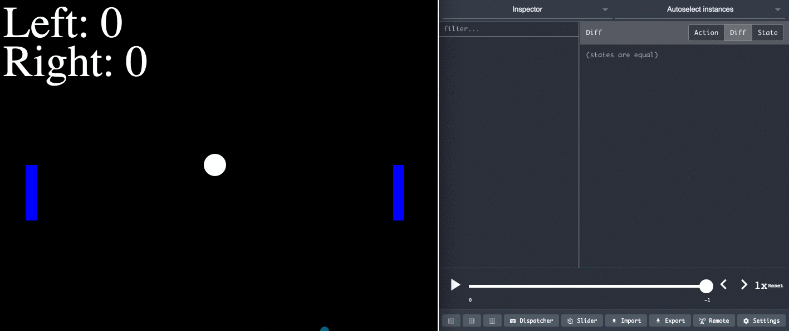
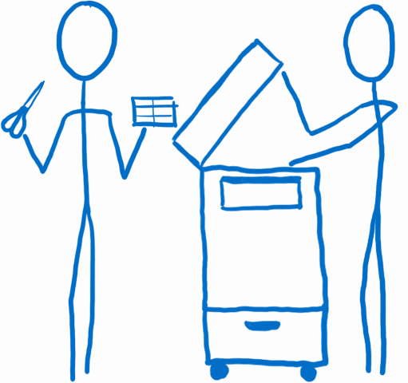

# Redux


Mirakl - Zacaria Chtatar - July 2017

https://github.com/Zacaria/learn-redux-reveal

---

The aim of the talk is to understand the **concept** of Redux

---

## Program

- Context <!-- .element: class="fragment" data-fragment-index="1" -->
- Actors <!-- .element: class="fragment" data-fragment-index="2" -->
- Workflow <!-- .element: class="fragment" data-fragment-index="3" -->
- Example <!-- .element: class="fragment" data-fragment-index="4" -->

---

<!-- .slide: data-background="imgs/pexels-photo.jpg" class="overlay-title"-->

## A bit of history

----

## MVC

The first front end architecture


Problem : front-end apps become more complex, we need to scale <!-- .element: class="fragment" data-fragment-index="1" -->

----

## Flux

- With react release, components allow efficient view reusability

- Still, UI state management is a challenge  <!-- .element: class="fragment" data-fragment-index="1" -->

- Facebook encourages to use a state container pattern <!-- .element: class="fragment" data-fragment-index="2" -->

- Flux introduces uni-directional data flow <!-- .element: class="fragment" data-fragment-index="3" -->

 <!-- .element: class="fragment" data-fragment-index="4" -->

----

At [react-europe 2015](https://www.youtube.com/watch?v=xsSnOQynTHs), Dan Abramov creates redux to make a POC

The aim was just to enhance developer tools <!-- .element: class="fragment" data-fragment-index="1" -->

----

## Hot Module Reload


----

## Time travel



---

## Keep in mind

- Without sanity checks, [99 lines](https://gist.github.com/gaearon/ffd88b0e4f00b22c3159) of code
- A concept more than a library
- [May not be suited](https://medium.com/@dan_abramov/you-might-not-need-redux-be46360cf367) for all projects

---

## What Redux wants to do

- Gather all application data on a single point : the store
- Express store modification using objects : the actions
- Modify the store at one place : the reducers


---

## Casting


---

## Store


----

## Store

- Holds the state of the app as the single source of truth.
<li class="fragment" data-fragment-index="1">
Allows access to the state via `getState()`.
</span>
<li class="fragment" data-fragment-index="2">
Allows the state to be updated via `dispatch(action)`.
</span>
<li class="fragment" data-fragment-index="3">
Registers listeners via `subscribe(listener)`.
</span>
<li class="fragment" data-fragment-index="3">
Handles listeners unregistering via the function returned by`subscribe(listener)`.
</span>

----

How to: create a store

```
import { createStore } from 'redux';

const store = createStore(reducers);
```

---

## Action creator


----

## Action creator

A function returning an action.

An action is an object having at least a type key which has a string value <!-- .element: class="fragment" data-fragment-index="1" -->

```
const editPDS = description => ({
  type: 'EDIT_PDS',
  description,
});
```
<!-- .element: class="fragment" data-fragment-index="2" -->

---

## Reducers



----

## Like Array.prototype.reduce()

```
const defaultCount = 0;
const count = 5;

const newCount = [count].reduce(
    (state, action) => {
        return state + action.value;
    },
    count || defaultCount
);
```

----

## Reducers

Creates new versions of the state using action and current state.

```
const orders = (state = false, action) => {
  if (action.type === 'ACCEPT_ORDER') {
      return true;
  }

  return state;
};
```
<!-- .element: class="fragment" data-fragment-index="1" -->

1. Always return state <!-- .element: class="fragment" data-fragment-index="2" -->
2. No mutation <!-- .element: class="fragment" data-fragment-index="3" -->
3. Pure function <!-- .element: class="fragment" data-fragment-index="4" -->


----

<!-- .slide: data-transition="none" -->

Classic pattern : reducer API

```
const orders = (state, action) => {


};
```

----

<!-- .slide: data-transition="none" -->

Switch on action type

```
const orders = (state, action) => {
  switch (action.type) {


  }
};
```

----

<!-- .slide: data-transition="none" -->

Return state

```
const orders = (state, action) => {
  switch (action.type) {


    default:
      return state;
  }
};
```

----

<!-- .slide: data-transition="none" -->

Add some logic

```
const orders = (state, action) => {
  switch (action.type) {
    case 'ACCEPT_ORDER':
      return state.map(order => {
        if(order.id === action.id) {
            return {...order, accepted: true};
        }
      });


    default:
      return state;
  }
};
```

----

<!-- .slide: data-transition="none" -->

Add some logic (again)

```
const orders = (state, action) => {
  switch (action.type) {
    case 'ACCEPT_ORDER':
      return state.map(order => {
        if(order.id === action.id) {
            return {...order, accepted: true};
        }
      });
    case 'REJECT_ORDER':
      return state.map(order => {
        if(order.id === action.id) {
            return {...order, accepted: false};
        }
      });
    default:
      return state;
  }
};
```

----

Combine reducers

```
import { combineReducers } from 'redux';
import orders from './orders';
import offers from './offers';

const reducers = combineReducers({
  orders,
  offers
});

export default reducers;
```

---

## Views


----

## Views

React stuff:

* A container is bound to business terms
* A component is not business aware
* Internal state should not be used

---

## View layer binding


----

## View layer binding

is react-redux <!-- .element: class="fragment" data-fragment-index="1" -->

[the library](https://github.com/reactjs/react-redux) <!-- .element: class="fragment" data-fragment-index="2" -->

---

## Root component


----

Component standing at the top-level application

Puts all team together to work well.

---

## ⏪ Recap

---

## Init store


----

```
import { createStore } from 'redux';
```
<!-- .element: class="fragment" data-fragment-index="1" -->

```
import { Provider } from 'react-redux';
```
<!-- .element: class="fragment" data-fragment-index="2" -->
```
import reducers  from './redux';
const store = createStore(reducers);
```
<!-- .element: class="fragment" data-fragment-index="1" -->
```
const Root = () => (
```
<!-- .element: class="fragment" data-fragment-index="0" -->
```
  <Provider store={store}>
```
<!-- .element: class="fragment" data-fragment-index="2" -->
```
    <div>
      <ListMessage/>
      <AddMessage/>
    </div>
```
<!-- .element: class="fragment" data-fragment-index="0" -->
```
  </Provider>
```
<!-- .element: class="fragment" data-fragment-index="2" -->
```
);
```
<!-- .element: class="fragment" data-fragment-index="0" -->

----

```
import { createStore } from 'redux';
import { Provider } from 'react-redux';

import reducers  from './redux';
const store = createStore(reducers);

const Root = () => (
  <Provider store={store}>
    <div>
      <ListMessage/>
      <AddMessage/>
    </div>
  </Provider>
);
```

----

Reducers have the same shape as the store.

```
import {createStore, applyMiddleware} from 'redux';
import todoApp from './reducers';
import thunk from 'redux-thunk';
import createLogger from 'redux-logger';

const configureStore = () => {
  //only plain object reach createLogger middleware and then reducers
  const middlewares = [thunk];
  if (process.env.NODE_ENV !== 'production') {
    middlewares.push(createLogger());
  }

  return createStore(todoApp, applyMiddleware(...middlewares));
};

export default configureStore;
```

---

## Connect store and components


----

Map - inject - Redux state to container props

```
const mapStateToProps = state => {
  return {
    id: state.currentPDS.id,
    description: state.currentPDS.description,
  };
};
```

Map dispatchable as callback to container props <!-- .element: class="fragment" data-fragment-index="1" -->

```
const mapDispatchToProps = dispatch => {
  return {
    editPDS: description => dispatch(editPDS(description)),
  };
};
```
<!-- .element: class="fragment" data-fragment-index="1" -->

Triggered at each store update. <!-- .element: class="fragment" data-fragment-index="2  " -->


----

Connect store and view

```
export default connect(mapStateToProps, mapDispatchToProps)(PDSEdit)
```

Use connected component inside Provider <!-- .element: class="fragment" data-fragment-index="1" -->

```
<Provider store={store}>
  <PDSEdit />
</Provider>
```
<!-- .element: class="fragment" data-fragment-index="1" -->

---

## Prepare action Callbacks


----

Pass bound action to components

```
const PDSEdit = ({ editPDS }) => (
    <PDSEditForm onSubmit={editPDS} />
);

const mapDispatchToProps = dispatch => {
  return {
    editPDS: description => dispatch(editPDS(description)),
  };
};

export default connect(mapStateToProps, mapDispatchToProps)(PDSEdit);`
```

---

## Workflow


---

## Sum up

Using Redux means making trade-offs: <!-- .element: class="fragment" data-fragment-index="0" -->

- Describe app state as array or object <!-- .element: class="fragment" data-fragment-index="1" -->
- Describe changes as plain objects <!-- .element: class="fragment" data-fragment-index="2" -->
- Describe logic to handle changes as pure functions <!-- .element: class="fragment" data-fragment-index="3" -->

To get guarantees: <!-- .element: class="fragment" data-fragment-index="4" -->

- 100% predictable UI state <!-- .element: class="fragment" data-fragment-index="5" -->
- Decouple what happened from how thing changes <!-- .element: class="fragment" data-fragment-index="6" -->
- Mutation tracking <!-- .element: class="fragment" data-fragment-index="7" -->

---

## Credits

> Dan Abramov: [<i class="fa fa-twitter" aria-hidden="true"></i>](https://twitter.com/dan_abramov?lang=fr) [<i class="fa fa-github" aria-hidden="true"></i>](https://github.com/gaearon)


> Lin Clark: [<i class="fa fa-medium" aria-hidden="true"></i>](https://code-cartoons.com/@linclark)

---

## Links

Main learning ref : 10 hours : http://redux.js.org/

Videos :

- lvl 1 : 121 min : https://egghead.io/courses/getting-started-with-redux
- lvl 2 : 137 min : https://egghead.io/courses/building-react-applications-with-idiomatic-redux
- react-europe : 30 min : https://www.youtube.com/watch?v=xsSnOQynTHs

Articles :

- 11 min : https://code-cartoons.com/a-cartoon-intro-to-redux-3afb775501a6

Awesome list : https://github.com/brillout/awesome-redux
