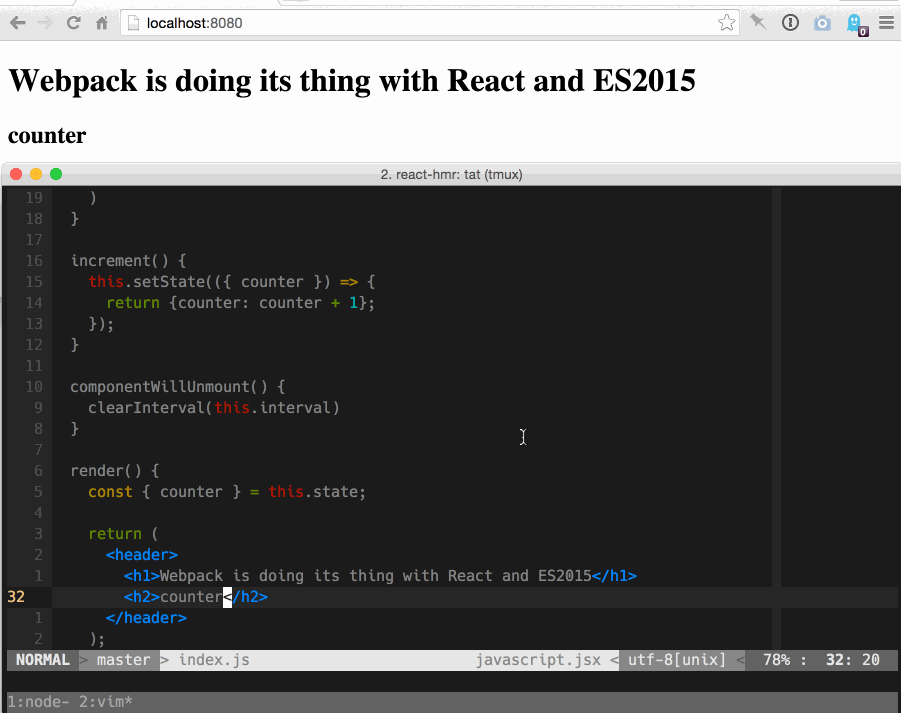
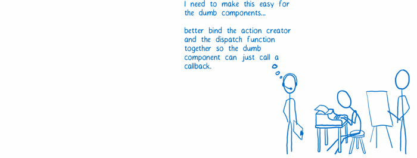
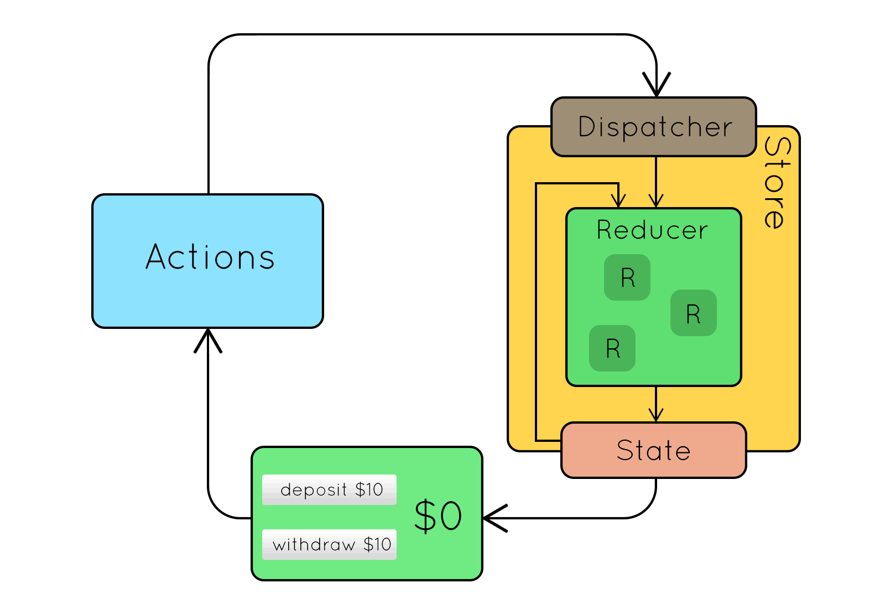

# Redux


Mirakl - Zacaria Chtatar - July 2017

https://github.com/Zacaria/learn-redux-reveal

---

The aim of the talk is to understand the **concept** of Redux. <!-- .element: class="fragment" data-fragment-index="1" -->


---

## Program

- Live code React
- Context <!-- .element: class="fragment" data-fragment-index="1" -->
- Actors <!-- .element: class="fragment" data-fragment-index="2" -->
- Workflow <!-- .element: class="fragment" data-fragment-index="3" -->
- Live code Redux
- Example <!-- .element: class="fragment" data-fragment-index="4" -->

---

<!-- .slide: data-background="imgs/pexels-photo.jpg" class="overlay-title"-->

## A bit of history

----

## MVC

The first front end architecture


Problem : front-end apps become more complex, we need to scale <!-- .element: class="fragment" data-fragment-index="1" -->

----

## Flux

- With react release, components allow efficient view reusability

- Still, UI state management is a challenge  <!-- .element: class="fragment" data-fragment-index="1" -->

- Facebook encourages to use a state container pattern <!-- .element: class="fragment" data-fragment-index="2" -->

- Flux introduces uni-directional data flow <!-- .element: class="fragment" data-fragment-index="3" -->

 <!-- .element: class="fragment" data-fragment-index="4" -->

----

At [react-europe 2015](https://www.youtube.com/watch?v=xsSnOQynTHs), Dan Abramov creates redux to make a POC

The aim was just to enhance developer tools <!-- .element: class="fragment" data-fragment-index="1" -->

It turns out that this experiment became one of the most popular front-end pattern. <!-- .element: class="fragment" data-fragment-index="2" -->

----

## Hot Module Reload



----

## Time travel


---

## Front-end challenges

- ✅ Structure & scalability <!-- .element: class="fragment" data-fragment-index="1" -->

- ✅ Predictable UI <!-- .element: class="fragment" data-fragment-index="2" -->

- ✅ Mutation tracking <!-- .element: class="fragment" data-fragment-index="3" -->

- ✅ Technology agnostic <!-- .element: class="fragment" data-fragment-index="4" -->

----

## How do we achieve it ?

- Gather all application data on a single point : the store
- Express store modification using objects : the actions
- Modify the store at one place : the reducers


---

## Keep in mind

- Without sanity checks, [99 lines](https://gist.github.com/gaearon/ffd88b0e4f00b22c3159) of code
- A concept more than a library
- [May not be suited](https://medium.com/@dan_abramov/you-might-not-need-redux-be46360cf367) for all projects

---

## Casting


---

## Store


----

## Store

- Holds the state of the app as the single source of truth.
<li class="fragment" data-fragment-index="1">
Allows access to the state via `getState()`.
</span>
<li class="fragment" data-fragment-index="2">
Allows the state to be updated via `dispatch(action)`.
</span>
<li class="fragment" data-fragment-index="3">
Registers listeners via `subscribe(listener)`.
</span>
<li class="fragment" data-fragment-index="3">
Handles listeners unregistering via the function returned by`subscribe(listener)`.
</span>

----

## Store and state ?

- Store is the container <!-- .element: class="fragment" data-fragment-index="1" -->

- State is the content <!-- .element: class="fragment" data-fragment-index="2" -->

----

How to create a store

```
import { createStore } from 'redux';

const defaultValue = {};

const reducers = (state, action) => {
  // some logic with action
  
  return state
};

const store = createStore(reducers, defaultValue);
```

----

Example

```
// state = { id: 12 }
// action = { type: 'UPDATE_ID', id: 13 }
```
<!-- .element: class="fragment" data-fragment-index="1" -->

```
const idReducer = (state, action) => {
  if(action.type === 'UPDATE') {
    return { id: action.id }; // ??
  }

  return state; // ??
};

const store = createStore(idReducer, { id: 12 });
// store.getState() = { id: 12 }
```
<!-- .element: class="fragment" data-fragment-index="2" -->

```
const store = createStore({ toto: idReducer }, ???);
```
<!-- .element: class="fragment" data-fragment-index="3" -->

---

## Action creator


----

## Action creator

A function returning an ~~object~~ action.

An action is an object having at least a type key which has a string value <!-- .element: class="fragment" data-fragment-index="1" -->

```
const editPDS = description => ({
  type: 'EDIT_PDS',
  description: description,
});
```
<!-- .element: class="fragment" data-fragment-index="2" -->

```
editPDS('Awesome description'); // ??
```
<!-- .element: class="fragment" data-fragment-index="3" -->


```
{
  type: 'EDIT_PDS',
  description: 'Awesome description',
}
```
<!-- .element: class="fragment" data-fragment-index="4" -->

---

## Reducers


----

## Reducers

Function creating a new version of the state... <!-- .element: class="fragment" data-fragment-index="1" -->

```
const orderReducer = () => {
    return {};
}
```
<!-- .element: class="fragment" data-fragment-index="1" -->

...using an action and the current state slice. <!-- .element: class="fragment" data-fragment-index="2" -->

```
// ordersState = [1, 2, 3]
// action = { type: 'ACCEPT_ORDER' }

const orderReducer = (ordersState = false, action) => {
  if (action.type === 'ACCEPT_ORDER') {
      return true;
  }
  return ordersState;
};
```
<!-- .element: class="fragment" data-fragment-index="3" -->

1. Always return state <!-- .element: class="fragment" data-fragment-index="2" -->
2. Pure function <!-- .element: class="fragment" data-fragment-index="3" -->

----

Now lets say our state is

```
ordersState = [
    {
        id: 60,
        accepted: false,
    },
    {
        id: 70,
        accepted: false,
    }
]
```

----

And our pure function

```
const acceptOrder = (orders, id) => {
    const newOrders = orders.map(order => { // new array
       if(order.id === id) {
           return {...order, accepted: true};
       }
     });

    return newOrders;
}
```

Updates an object of the given array <!-- .element: class="fragment" data-fragment-index="1" -->

----

<!-- .slide: data-transition="none" -->

Classic pattern : reducer API

```
const ordersReducer = (ordersState = [], action) => {


};
```

----

<!-- .slide: data-transition="none" -->

Switch on action type

```
const ordersReducer = (ordersState = [], action) => {
  switch (action.type) {


  }
};
```

----

<!-- .slide: data-transition="none" -->

Return state

```
const ordersReducer = (ordersState = [], action) => {
  switch (action.type) {


    default:
      return ordersState;
  }
};
```

----

<!-- .slide: data-transition="none" -->

Add some logic

```
const ordersReducer = (ordersState = [], action) => {
  switch (action.type) {
    case 'ACCEPT_ORDER':
      return acceptOrder(ordersState, action.id);


    default:
      return ordersState;
  }
};
```

----

<!-- .slide: data-transition="none" -->

```
// ordersState = [{id: '00', accepted: false }, {id: '01', accepted: false }]
```

```
const ordersReducer = (ordersState = [], action) => {
  switch (action.type) {
    case 'ACCEPT_ORDER':
      return acceptOrder(ordersState, action.id);
    case 'REJECT_ORDER':
      return reject(ordersState, action.id);
    default:
      return ordersState;
  }
};
```

```
action = { type: 'TOGGLE_SIDEBAR' } // ???
```
<!-- .element: class="fragment" data-fragment-index="1" -->

```
action = { id: '00' } // ???
```
<!-- .element: class="fragment" data-fragment-index="2" -->

```
action = { type: 'ACCEPT_ORDER', id: '00' } // ???
```
<!-- .element: class="fragment" data-fragment-index="3" -->


----

Combine reducers

```
import { combineReducers } from 'redux';
import ordersReducer from './orders';
import offersReducer from './offers';

const reducers = combineReducers({
  orders: ordersReducer,
  offers: offersReducer,
});

export default reducers;
```

---

## Get ready to plug !


----

Init


----

Runtime


----

Code


---

## Views


----

## Views

React stuff:

* A container is bound to business terms
* A component is not business aware
* Internal state should not be used

---

## View layer binding


----

## View layer binding

is react-redux <!-- .element: class="fragment" data-fragment-index="1" -->

[the library](https://github.com/reactjs/react-redux) <!-- .element: class="fragment" data-fragment-index="2" -->

---

## Root component


----

Component standing at the top-level application

Puts all team together to work well.

---

## ⏪ Recap

---

## Init store


----

<!-- .slide: data-transition="none" -->

```
import { createStore } from 'redux';
```
<!-- .element: class="fragment" data-fragment-index="1" -->

```
import { Provider } from 'react-redux';
```
<!-- .element: class="fragment" data-fragment-index="2" -->
```
import reducers  from './redux';
const store = createStore(reducers);
```
<!-- .element: class="fragment" data-fragment-index="1" -->
```
const Root = () => (
```
<!-- .element: class="fragment" data-fragment-index="0" -->
```
  <Provider store={store}>
```
<!-- .element: class="fragment" data-fragment-index="2" -->
```
    <div>
      <ListMessage/>
      <AddMessage/>
    </div>
```
<!-- .element: class="fragment" data-fragment-index="0" -->
```
  </Provider>
```
<!-- .element: class="fragment" data-fragment-index="2" -->
```
);
```
<!-- .element: class="fragment" data-fragment-index="0" -->

----

<!-- .slide: data-transition="none" -->

```
import { createStore } from 'redux';
import { Provider } from 'react-redux';

import reducers  from './redux';
const store = createStore(reducers);

const Root = () => (
  <Provider store={store}>
    <div>
      <ListMessage/>
      <AddMessage/>
    </div>
  </Provider>
);
```

---

## Connect store and components


----

Map - inject - Redux state to container props

```
const mapStateToProps = state => {
  return {
    id: state.currentPDS.id,
    description: state.currentPDS.description,
  };
};
```

Map dispatchable as callback to container props <!-- .element: class="fragment" data-fragment-index="1" -->

```
const mapDispatchToProps = dispatch => {
  return {
    editPDS: description => dispatch(editPDS(description)),
  };
};
```
<!-- .element: class="fragment" data-fragment-index="1" -->

Triggered at each store update. <!-- .element: class="fragment" data-fragment-index="2  " -->


----

Connect store and view

```
export default connect(mapStateToProps, mapDispatchToProps)(PDSEdit)
```

Use connected component inside Provider <!-- .element: class="fragment" data-fragment-index="1" -->

```
<Provider store={store}>
  <PDSEdit />
</Provider>
```
<!-- .element: class="fragment" data-fragment-index="1" -->

---

## Prepare action Callbacks



----

Pass bound action to components

```
const PDSEdit = ({ editPDS }) => (
    <PDSEditForm onSubmit={editPDS} />
);

const mapDispatchToProps = dispatch => {
  return {
    editPDS: description => dispatch(editPDS(description)),
  };
};

export default connect(mapStateToProps, mapDispatchToProps)(PDSEdit);`
```

---

## Workflow


----



---

## Sum up

Using Redux means making trade-offs: <!-- .element: class="fragment" data-fragment-index="0" -->

- Describe app state as array or object <!-- .element: class="fragment" data-fragment-index="1" -->
- Describe changes as plain objects <!-- .element: class="fragment" data-fragment-index="2" -->
- Describe logic to handle changes as pure functions <!-- .element: class="fragment" data-fragment-index="3" -->

To get guarantees: <!-- .element: class="fragment" data-fragment-index="4" -->

- 100% predictable UI state <!-- .element: class="fragment" data-fragment-index="5" -->
- Decouple what happened from how thing changes <!-- .element: class="fragment" data-fragment-index="6" -->
- Mutation tracking <!-- .element: class="fragment" data-fragment-index="7" -->

---

## Live example

<a href="https://codesandbox.io/s/j2pRG0Yol" target="_blank">
    
</a>

----

Me if I have to show this slide

<a href="https://codesandbox.io/s/QvPgmvl9" target="_blank">
    
</a>


---

## Credits

> Dan Abramov: [<i class="fa fa-twitter" aria-hidden="true"></i>](https://twitter.com/dan_abramov?lang=fr) [<i class="fa fa-github" aria-hidden="true"></i>](https://github.com/gaearon)


> Lin Clark: [<i class="fa fa-medium" aria-hidden="true"></i>](https://code-cartoons.com/@linclark)

---

# Thank you

Question ? <!-- .element: class="fragment" data-fragment-index="1" -->

---

## Links

- Main learning ref : 10 hours : http://redux.js.org/
- Videos :
    - lvl 1 : 121 min : [egghead 1](https://egghead.io/courses/getting-started-with-redux)
    - lvl 2 : 137 min : [egghead 2](https://egghead.io/courses/building-react-applications-with-idiomatic-redux)
    - react-europe : 30 min : [video](https://www.youtube.com/watch?v=xsSnOQynTHs)
- Articles :
    - 11 min : [cartoon](https://code-cartoons.com/a-cartoon-intro-to-redux-3afb775501a6)
- Awesome list : https://github.com/brillout/awesome-redux
