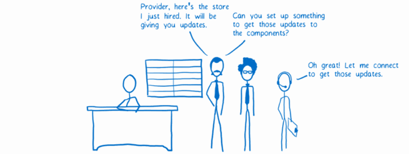
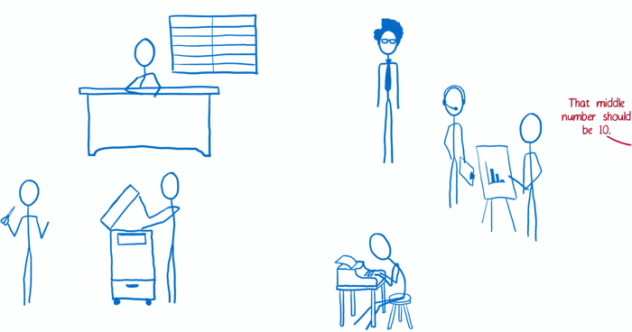

# Redux

---

Histoire : Redux : Reduce + Flux
Without redux: hoist

But : Front-end app scale
Gérer simplement des app complexes
poser des contraintes pour avoir des garanties
  => tradeoffs
    - Describe app state as array or object
    - Describe changes as plain objects
    - Describe logic to handle changes as pure fonctions

  What we get
    - Debug with UI state
    - Decouple what happened from how thing changes

Immutable store ? Mutation tracking

Developer friendly : tool demo

----
----
----
----

---

Casting

---

## Store


----

## Store

- Holds the state of the app as the single source of truth.
<li class="fragment" data-fragment-index="1">
Allows access to the state via `getState()`.
</span>
<li class="fragment" data-fragment-index="2">
Allows the state to be updated via `dispatch(action)`.
</span>
<li class="fragment" data-fragment-index="3">
Registers listeners via `subscribe(listener)`.
</span>
<li class="fragment" data-fragment-index="3">
Handles listeners unregistering via the function returned by`subscribe(listener)`.
</span>

----

How to: create a store

```
import { createStore } from 'redux';

const store = createStore(reducers);
```

---

## Action creator


----

## Action creator

A function returning an action.

An action is an object having at least a type key which has a string value <!-- .element: class="fragment" data-fragment-index="1" -->

```
const editPDS = description => ({
  type: 'EDIT_PDS',
  description,
});
```
<!-- .element: class="fragment" data-fragment-index="2" -->

---

## Reducers


----

## Reducers

Creates new versions of the state using action and current state.

How to: create a reducer <!-- .element: class="fragment" data-fragment-index="1" -->

```
const orders = (state = false, action) => {
  if (action.type === 'ACCEPT_ORDER') {
      return true;
  }

  return state;
};
```
<!-- .element: class="fragment" data-fragment-index="1" -->

Always return state ! <!-- .element: class="fragment" data-fragment-index="2" -->

----

Classic pattern : reducer API

```
const orders = (state, action) => {


};
```

----

Switch on action type

```
const orders = (state, action) => {
  switch (action.type) {


  }
};
```

----

Return state

```
const orders = (state, action) => {
  switch (action.type) {


    default:
      return state;
  }
};
```

----

Add some logic

```
const orders = (state, action) => {
  switch (action.type) {
    case 'ACCEPT_ORDER':
      return state.map(order => {
        if(order.id === action.id) {
            return {...order, accepted: true};
        }
      });


    default:
      return state;
  }
};
```

----

Add some logic (again)

```
const orders = (state, action) => {
  switch (action.type) {
    case 'ACCEPT_ORDER':
      return state.map(order => {
        if(order.id === action.id) {
            return {...order, accepted: true};
        }
      });
    case 'REJECT_ORDER':
      return state.map(order => {
        if(order.id === action.id) {
            return {...order, accepted: false};
        }
      });
    default:
      return state;
  }
};
```

----

Combine reducers

```
import { combineReducers } from 'redux';
import orders from './orders';
import offers from './offers';

const reducers = combineReducers({
  orders,
  offers
});

export default reducers;
```

---

## Views


----

## Views

React stuff:

* A container is bound to business terms
* A component is not business aware
* Internal state should not be used

---

## View layer binding


----

Map Redux state to container props

```
const mapStateToProps = state => {
  return {
    id: state.currentPDS.id,
    description: state.currentPDS.description,
  };
};
```

Map store dispatch to container props <!-- .element: class="fragment" data-fragment-index="1" -->

```
const mapDispatchToProps = dispatch => {
  return {
    editPDS: description => dispatch(editPDS(description)),
  };
};
```
<!-- .element: class="fragment" data-fragment-index="1" -->

----

Connect store and view

```
export default connect(mapStateToProps, mapDispatchToProps)(PDSEditForm)
```

Use connected component inside Provider <!-- .element: class="fragment" data-fragment-index="1" -->

```
<Provider store={store}>
  <PDSEditForm />
</Provider>
```
<!-- .element: class="fragment" data-fragment-index="1" -->

----

## View layer binding

is react-redux <!-- .element: class="fragment" data-fragment-index="1" -->

[the library](https://github.com/reactjs/react-redux) <!-- .element: class="fragment" data-fragment-index="2" -->

---

## Root component


----

Component standing at the top-level application

Puts all team together to work well.

---

## ⏪ Recap

---

## Init store


----

```
import { createStore } from 'redux';
```
<!-- .element: class="fragment" data-fragment-index="1" -->

```
// not redux ! It is a sugarcoat
import { Provider } from 'react-redux';
```
<!-- .element: class="fragment" data-fragment-index="2" -->
```
import reducers  from './redux';
// Init store
const store = createStore(reducers);
```
<!-- .element: class="fragment" data-fragment-index="1" -->
```
const Root = () => (
```
<!-- .element: class="fragment" data-fragment-index="0" -->
```
  <Provider store={store}>
```
<!-- .element: class="fragment" data-fragment-index="2" -->
```
    <div>
      <ListMessage/>
      <AddMessage/>
    </div>
```
<!-- .element: class="fragment" data-fragment-index="0" -->
```
  </Provider>
```
<!-- .element: class="fragment" data-fragment-index="2" -->
```
);
```
<!-- .element: class="fragment" data-fragment-index="0" -->

----

```
import { createStore } from 'redux';

// not redux ! It is a sugarcoat
import { Provider } from 'react-redux';

import reducers  from './redux';
// Init store
const store = createStore(reducers);

const Root = () => (
  <Provider store={store}>
    <div>
      <ListMessage/>
      <AddMessage/>
    </div>
  </Provider>
);
```

----

Reducers have the same shape as the store.

```
import {createStore, applyMiddleware} from 'redux';
import todoApp from './reducers';
import thunk from 'redux-thunk';
import createLogger from 'redux-logger';

const configureStore = () => {
  //only plain object reach createLogger middleware and then reducers
  const middlewares = [thunk];
  if (process.env.NODE_ENV !== 'production') {
    middlewares.push(createLogger());
  }

  return createStore(todoApp, applyMiddleware(...middlewares));
};

export default configureStore;
```

---

## Connect store and components



----

Inject into root component

```
const store = configureStore();

ReactDOM.render(
  <Root store={store}/>, document.getElementById('mount-point'));
```

---

## Prepare action Callbacks


----

Map dispatch to props

```
const mapDispatchToProps = dispatch => {
  return bindActionCreators({
    sendMessage,
    changeNewMessage,
  }, dispatch);
};

export default connect(mapStateToProps, mapDispatchToProps)(AddMessage);`
```

---

## Workflow




---


### Credits

> Lin Clark : code-cartoons.com
